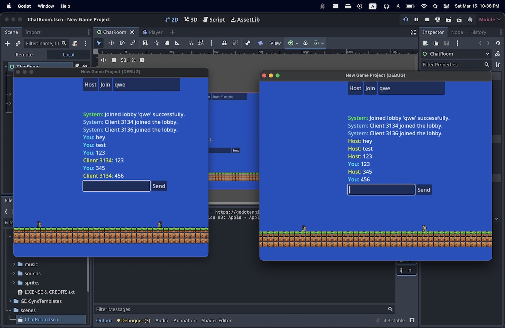

# Slimefall-2

A multiplayer slime chat platformer made in Godot 4 with GDSync.  
You can run, jump, type random stuff, and watch slimes do the same.



---

## Features

- Multiplayer with GDSync (peer-to-peer WebRTC)
- Lobby creation & chat log
- Simple 2D platformer movement
- Real-time player direction & animation syncing

---

## Try it locally

### Requirements:
- [Godot 4.x](https://godotengine.org/download)
- GDSync addon (included)
- A GDSync API key (`gd_sync_secrets.cfg` with `public_key` and `private_key`)

### Running:

```bash
git clone https://github.com/yourname/slimefall-2.git
cd slimefall-2
godot4 project.godot
```

Then hit **Play** and:
- Click **Host** to start a new lobby
- Or type a room name and click **Join**

---

## 🔐 Setup GDSync Keys

You need a `gd_sync_secrets.cfg` file in the root:

```ini
[gd_sync]
private_key="your_private_key"
```

You can get these keys by signing up at [gd-sync](https://www.gd-sync.com/)

---

## 🧠 Dev Notes

- `ChatRoom.gd` handles multiplayer logic, spawning players, syncing chat & positions
- `player.gd` handles local movement + animation, and calls `update_animation()` on ChatRoom for remote updates
- Uses `GDSync.call_func(...)` to sync peer state
- Syncing is minimal: just position + animations — physics is client-authoritative

---

## 📦 Folder Structure

```
scripts/        # ChatRoom + Player logic
scenes/         # Main scene, Player.tscn
assets/         # Sprites, fonts, etc.
addons/         # GDSync plugin
```

---

## 🐌 License

MIT. Go make weird multiplayer things.

---

## 🙃 Credits

Built with too much coffee and not enough test cases.  
Powered by Godot, GDSync, and slime energy.

